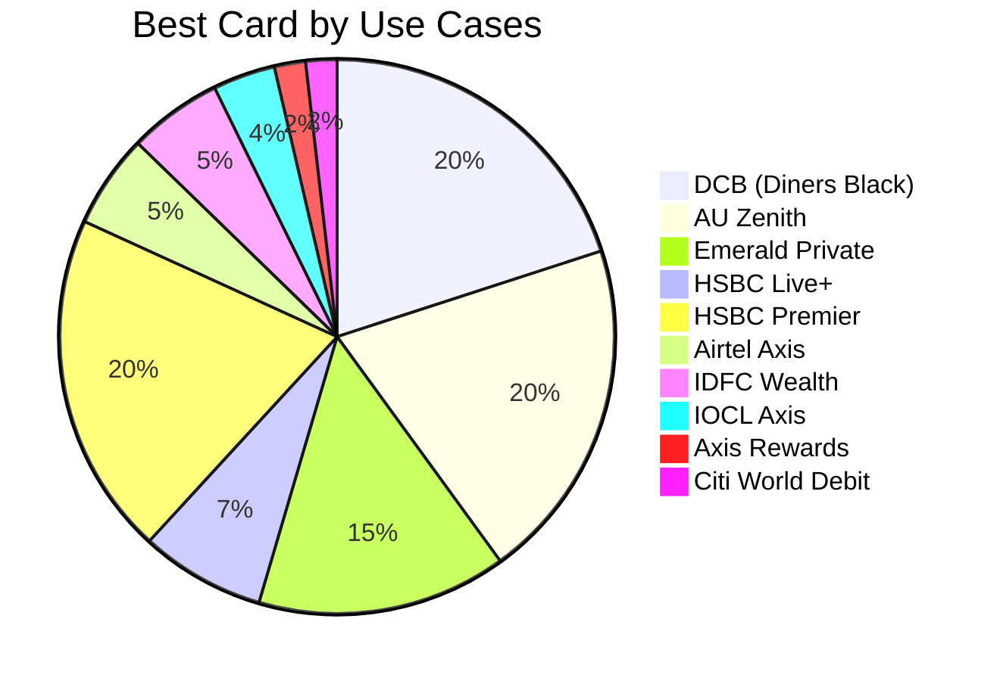
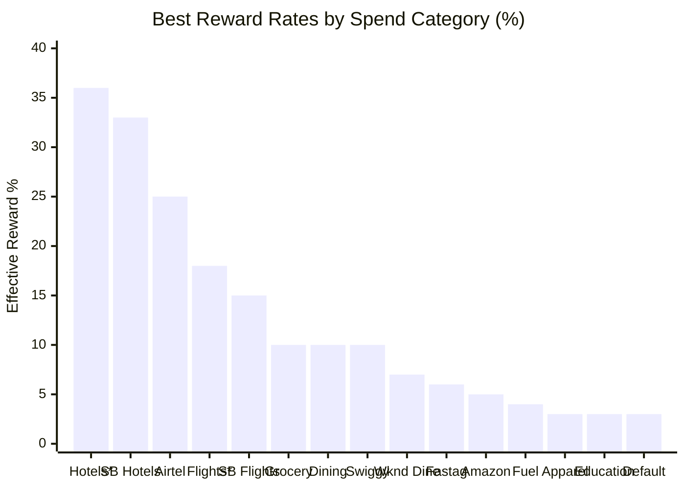
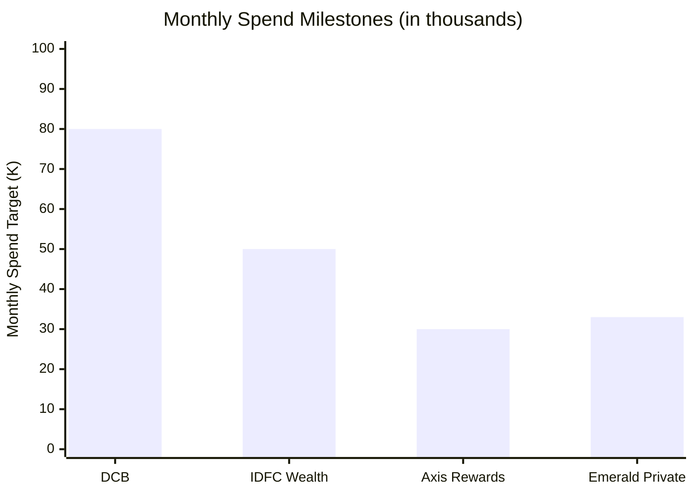

# 💳 Credit Card Rewards Rate Cheatsheet

> Personal credit card rewards optimization guide — maximizing cashback and rewards across all spending categories.

---

## 📊 Dashboard

### Card Portfolio — Optimal Use Cases

How many "best use" spend categories each card covers:

### Top Rewards Rates by Category

Highest effective reward/cashback rates achievable:

> \* via iShop/HSBC Premier &nbsp;|&nbsp; SB = SmartBuy (DCB)

### Quick Card Selection Guide

```mermaid
flowchart TD
    START(["What are you spending on?"])

    START --> SHOP["Shopping"]
    START --> FOOD["Food & Dining"]
    START --> TRAVEL["Travel"]
    START --> BILLS["Bills & Utilities"]
    START --> OTHER["Other"]

    SHOP --> S1["Amazon<br/><b>ICICI Amazon 5%</b>"]
    SHOP --> S2["Flipkart<br/><b>SmartBuy DCB 6.66%</b>"]
    SHOP --> S3["Groceries<br/><b>HSBC Live+ 10%</b>"]
    SHOP --> S4["Apparel<br/><b>Axis Rewards 3.2%</b>"]
    SHOP --> S5["Gold/Jewellery<br/><b>Emerald Private 3%</b>"]

    FOOD --> F1["Swiggy / Zomato<br/><b>Airtel Axis 10%</b>"]
    FOOD --> F2["Weekend Dining<br/><b>DCB 6.66%</b>"]
    FOOD --> F3["Restaurants / Veg<br/><b>HSBC Live+ 10%</b>"]
    FOOD --> F4["Weekday Dining<br/><b>AU Zenith 4%</b>"]

    TRAVEL --> T1["Flights<br/><b>SmartBuy DCB 15%</b>"]
    TRAVEL --> T2["Hotels<br/><b>SmartBuy DCB 33%</b>"]
    TRAVEL --> T3["Bus / Train<br/><b>SmartBuy DCB 10%</b>"]
    TRAVEL --> T4["International<br/><b>Citi Debit 0% markup</b>"]

    BILLS --> B1["Airtel Recharge<br/><b>Airtel Axis 25%</b>"]
    BILLS --> B2["TNEB / Gas<br/><b>Airtel Axis 10%</b>"]
    BILLS --> B3["Insurance<br/><b>HSBC Premier 3%</b>"]
    BILLS --> B4["JioFiber<br/><b>Amazon Pay DCB 3x</b>"]

    OTHER --> O1["Fuel<br/><b>IOCL Axis UPI 4%</b>"]
    OTHER --> O2["Fastag<br/><b>AU Zenith+CRED 6%</b>"]
    OTHER --> O3["Education<br/><b>DCB 3.33%</b>"]
    OTHER --> O4["Movies<br/><b>AU Zenith BOGO</b>"]
    OTHER --> O5["Govt Txns<br/><b>IDFC Wealth 0.5%</b>"]
    OTHER --> O6["Everything Else<br/><b>HSBC Live+ 1.5%</b>"]

    style START fill:#0078D4,color:#fff,stroke:none
    style SHOP fill:#50E6FF,color:#000,stroke:none
    style FOOD fill:#50E6FF,color:#000,stroke:none
    style TRAVEL fill:#50E6FF,color:#000,stroke:none
    style BILLS fill:#50E6FF,color:#000,stroke:none
    style OTHER fill:#50E6FF,color:#000,stroke:none
```

### Milestone Spend Thresholds

Monthly/annual spend targets that unlock bonus rewards:

> **Note:** Emerald Private milestone is ₹4L per year (shown as ~₹33K/month equivalent)

---

## 💳 Card Summary

| Card | Best For | Top Rate | Milestone Benefit |
|:---|:---|:---:|:---|
| **DCB (Diners Black)** | SmartBuy travel, dining, education | 33% | >₹80K/mo → ₹1000 vouchers |
| **AU Zenith** | Dining, movies, fastag, offline retail | 4% | Birthday 2500 RP |
| **HSBC Live+** | Groceries, vegetables, restaurants | 10% | Unlimited 1.5% on all |
| **HSBC Premier** | Flights, hotels, insurance, govt, intl | 36% | EazyDiner Prime |
| **Airtel Axis** | Airtel bills, utilities, food delivery | 25% | — |
| **Emerald Private** | iShop travel, education, gold | 36% | >₹4L/yr → ₹3K voucher |
| **ICICI Amazon** | Amazon shopping | 5% | — |
| **IDFC Wealth** | Govt txns, movies, offline/online | 1.67% | >₹50K/mo → 10x rewards |
| **IOCL Axis** | Fuel stations (UPI) | 4% | — |
| **Axis Rewards** | Apparel and department stores | 3.2% | >₹30K/mo → 1500 RP |

---

## 🏆 Top Picks — Best Card per Category

| Category | Best Card | Rate | Via | Cap |
|:---|:---|:---:|:---|:---|
| Hotels | Emerald Private | **36%** | iShop | 10K RP/day |
| Hotels | DCB | **33%** | SmartBuy | 7500 RP/mo |
| Airtel Bills | Airtel Axis | **25%** | Airtel Thanks | ₹250/mo |
| Flights | HSBC Premier | **18%** | — | 1L spend/mo |
| Flights | DCB | **15%** | SmartBuy | 7500 RP/mo |
| Groceries / Veg | HSBC Live+ | **10%** | — | ₹1000/mo |
| Restaurants | HSBC Live+ | **10%** | — | ₹1000/mo |
| Swiggy / Zomato | Airtel Axis | **10%** | — | ₹500/mo |
| Utility Bills | Airtel Axis | **10%** | Airtel Thanks | ₹250/mo |
| Weekend Dining | DCB | **6.66%** | — | — |
| Fastag | AU Zenith | **6%** | CRED | ₹30/txn |
| Amazon | ICICI Amazon | **5%** | — | — |
| Fuel | IOCL Axis | **4%** | UPI | ₹200/mo |
| Weekday Dining | AU Zenith | **4%** | — | — |
| Apparel | Axis Rewards | **3.2%** | — | 7K RP/mo |
| Education | DCB / Emerald | **3.33%** | — | — |
| Govt Txns | IDFC Wealth | **0.5%** | — | — |
| Movies (BMS) | AU Zenith | **BOGO** | Visa Infinite | — |
| Movies (Paytm) | IDFC Wealth | **BOGO** | — | 2/mo |
| International | Citi World Debit | **0% DCC** | — | — |
| Everything Else | HSBC Live+ | **1.5%** | — | Unlimited |

---

## 🎯 DCB Redemption Value

Understanding the true value of DCB Reward Points:

| Redemption Method | Value per RP | Max per Month | Effective Rate |
|:---|:---:|:---:|:---|
| **Flights via SmartBuy** | ₹1.00 | 75,000 RP | Best value (70% redeemable) |
| **Airmiles** | 1 AirMile | — | Club Vistara / Krisflyer / Intermiles |
| **Product Catalog** | ₹0.50 | — | Half value |
| **Cashback** | ₹0.30 | 50,000 RP | Lowest value |

> **RP Validity:** 3 years from earning date

---

## 📁 Detailed Data

| Sheet | Description |
|:---|:---|
| [Rewards Rate](rewards-rate.md) | Complete card-by-category rewards rate table (45 categories) |
| [Which Card to Use](which-card-to-use.md) | Quick-reference: best card + platform per spend type (44 entries) |
| [Milestone Benefits](milestone-benefits.md) | Spend thresholds, bonus rewards, and DCB redemption guide |
